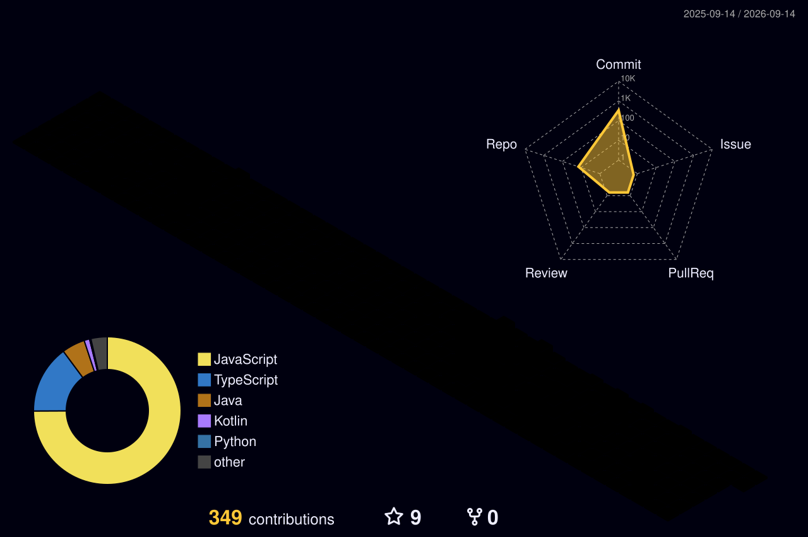

  

  

---

## 🛠 Technical Skills

**Languages**

  

**Frameworks & Libraries**

  
  
  
  

**Cloud, Databases & DevOps**

  

---

## 🚀 Key Projects

* **CUDA-Accelerated 3D CT Reconstruction:** High-performance iterative LSQR reconstruction solver running on GPU; optimized via custom forward/adjoint projection kernels.
* **InClass:** Geofenced smart attendance system featuring InsightFace biometric verification, WebAuthn (FIDO2) authentication, and real-time Socket.io streams.
* **CThru:** Hybrid static and Gemini AI-powered automated code review platform with actionable fixes and severity ranking.
* **ControlDesk:** Low-latency Android remote PC input controller using WebSockets and Kotlin Jetpack Compose.

---

## 📈 Activity Skyline & Telemetry

  

  
  

<!-- Your existing streak section stays here unchanged -->

---

## 📬 Connect With Me

<table align="center">
  <tr>
    <td align="center" style="padding: 10px;">
      
      
<strong>LinkedIn</strong>

    </td>
    <td align="center" style="padding: 10px;">
      
      
<strong>Email</strong>

    </td>
    <td align="center" style="padding: 10px;">
      
      
<strong>Portfolio</strong>

    </td>
  </tr>
</table>
